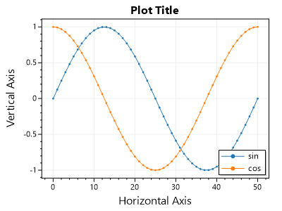
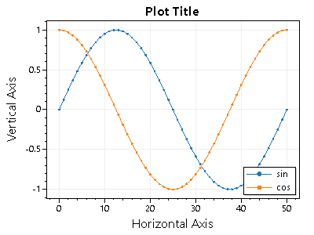

# Anti-Aliasing in ScottPlot

ScottPlot renders using high quality (anti-aliased) graphics by default. This functionality can be overwritten when requesting a render:

```cs
// set-up a sample plot
var plt = new ScottPlot.Plot(400, 300);
plt.AddSignal(ScottPlot.DataGen.Sin(51), label: "sin");
plt.AddSignal(ScottPlot.DataGen.Cos(51), label: "cos");
plt.YLabel("Vertical Axis");
plt.XLabel("Horizontal Axis");
plt.Title("Plot Title");
plt.Legend();

// render using different anti-aliasing settings
Bitmap highQualityBitmap = plt.Render(lowQuality: false);
Bitmap lowQualityBitmap = plt.Render(lowQuality: true);
```

High Quality (Anti-Aliasing On) | Low Quality (Anti-Aliasing Off)
---|---
|

## Mouse Interactions and Render Quality

By default, user controls render low quality (non-anti-aliased) graphics _during mouse interactions_ to improve responsiveness.

This behavior can be disabled or changed by editing the `Configuration.QualityMode` field in your user control.