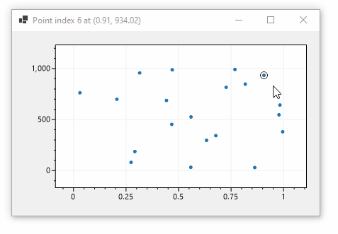

## Mouse Position in ScottPlot

This page documents how to use ScottPlot user controls to determine where the mouse cursor is and which data points are near it. 

### Determine where the Mouse Cursor Is

The latest position of the mouse can be accessed using the `GetMouseCoordinates()` method of the ScottPlot control. This example demonstrates using Windows Forms, but all ScottPlot controls use the same technique.

```cs
private void formsPlot1_MouseMoved(object sender, MouseEventArgs e)
{
    (double x, double y) = formsPlot1.GetMouseCoordinates();
    Console.WriteLine($"Mouse at ({x}, {y})");
}
```

💡 Position reported by `GetMouseCoordinates()` is not in pixel units. The X and Y values reported are in _coordinate space_, and have the same units as the horizontal and vertical axes of the plot.

## Find the Data Point Near the Cursor

**Some Plottables have public methods that make it easy to determine which data point is closest to the mouse cursor.** This makes it easy to implement functionality such as "show value on hover", or "highlight point under mouse".

This example demonstrates how to display the data point nearest the cursor whenever the mouse moves. It's showing using WinForms, but the code is virtually identical with all ScottPlot controls.

```cs
private void formsPlot1_MouseMove(object sender, MouseEventArgs e)
{
    (double mouseCoordX, double mouseCoordY) = formsPlot1.GetMouseCoordinates();
    double xyRatio = formsPlot1.Plot.XAxis.Dims.PxPerUnit / formsPlot1.Plot.YAxis.Dims.PxPerUnit;
    (double pointX, double pointY, int pointIndex) = MyScatterPlot.GetPointNearest(mouseCoordX, mouseCoordY, xyRatio);
    Text = $"Point index {pointIndex} at ({pointX}, {pointY})";
}
```

## Highlight the Data Point Near the Cursor

Since it is easy to determine which data point is nearest the cursor, it is possible to highlight it and display its position. If we have a scatter plot of blue dots displaying data points, one way to highlight a single point is to create a new plot using `AddPoint()` styled to be a hollow red circle, then move its position to indicate the point nearest the cursor.

<div class="text-center">



</div>

### Show Value Near Mouse with WinForms

[Download the full source code for this demo](https://github.com/ScottPlot/Website/tree/main/src/faq/mouse-position)

```cs
private readonly ScottPlot.Plottable.ScatterPlot MyScatterPlot;
private readonly ScottPlot.Plottable.ScatterPlot HighlightedPoint;
private int LastHighlightedIndex = -1;

public Form1()
{
    InitializeComponent();

    // create a scatter plot from some random data and save it
    Random rand = new Random(0);
    int pointCount = 20;
    double[] xs = ScottPlot.DataGen.Random(rand, pointCount);
    double[] ys = ScottPlot.DataGen.Random(rand, pointCount, multiplier: 1_000);
    MyScatterPlot = formsPlot1.Plot.AddScatterPoints(xs, ys);

    // Add a red circle we can move around later as a highlighted point indicator
    HighlightedPoint = formsPlot1.Plot.AddPoint(0, 0);
    HighlightedPoint.Color = Color.Red;
    HighlightedPoint.MarkerSize = 10;
    HighlightedPoint.MarkerShape = ScottPlot.MarkerShape.openCircle;
    HighlightedPoint.IsVisible = false;
}

private void formsPlot1_MouseMove(object sender, MouseEventArgs e)
{
    // determine point nearest the cursor
    (double mouseCoordX, double mouseCoordY) = formsPlot1.GetMouseCoordinates();
    double xyRatio = formsPlot1.Plot.XAxis.Dims.PxPerUnit / formsPlot1.Plot.YAxis.Dims.PxPerUnit;
    (double pointX, double pointY, int pointIndex) = MyScatterPlot.GetPointNearest(mouseCoordX, mouseCoordY, xyRatio);

    // place the highlight over the point of interest
    HighlightedPoint.Xs[0] = pointX;
    HighlightedPoint.Ys[0] = pointY;
    HighlightedPoint.IsVisible = true;

    // render if the highlighted point chnaged
    if (LastHighlightedIndex != pointIndex)
    {
        LastHighlightedIndex = pointIndex;
        formsPlot1.Render();
    }

    // update the GUI to describe the highlighted point
    Text = $"Point index {pointIndex} at ({pointX:N2}, {pointY:N2})";
}
```

## Notes

### Consider Performance

Locating the nearest point to the cursor requires an operation that (1) loops over every point in the dataset and (2) has to run every time the cursor's pixel position changes. When these two points combine on a large dataset, mouse-interactive performance may suffer. Users interested in high mouse interactivity should consider creating their own user control specifically designed for their application.

### Not all Plottables Have Mouse Helper Methods
However, but this functionality is easy to implement by the user. Since the user has access to the data being plotted and `GetMouseCoordinates()` this task is relatively straightforward. Iterate over every data point to determine its distance from the cursor and record which is closest.

### Display Scaling

**ScottPlot automatically detects and compensates for display scaling**, so you probably don't need to worry about it. Display scaling is handled differently by different GUI systems, so this detection logic lives inside the ScottPlot controls. If display scaling is enabled, mouse coordinates are automatically scaled to match the pixel units of the Bitmap that is displayed.

Windows forms may or may not support display scaling depending on which .NET platform you target and how your `Program.cs` is configured. To customize display scaling options in .NET WinForms applications, call [`SetHighDpiMode()`](https://docs.microsoft.com/en-us/dotnet/api/system.windows.forms.application.sethighdpimode).

For more information see [Setting the default DPI awareness for a process](https://docs.microsoft.com/en-us/windows/win32/hidpi/setting-the-default-dpi-awareness-for-a-process) and [Mixed-Mode DPI Scaling and DPI-aware APIs](https://docs.microsoft.com/en-us/windows/win32/hidpi/high-dpi-improvements-for-desktop-applications).
