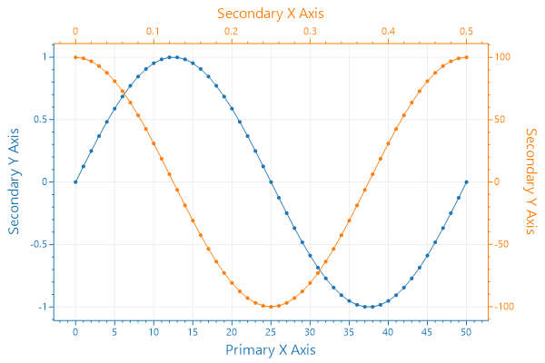
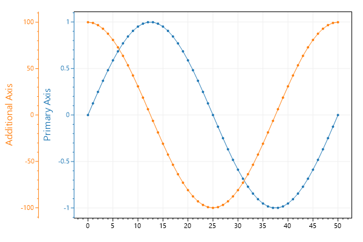

# Multiple Axes with ScottPlot

**This page reviews the primary functionality of ScottPlot's axis system.** A brief introduction to the ScottPlot API exists in the [**ScottPlot Overview**](../../overview). 

Users are encouraged to refer to the sample code in the latest [**ScottPlot Cookbook: Multi-Axis**](https://swharden.com/scottplot/cookbooks/4.1.9-beta/#multi-axis) section for version-specific syntax information.

💡 **TLDR:** _Every plottable has an `XAxisIndex` and `YAxisIndex` field that determines which axis it will render on. You can use the primary (bottom/left) or secondary (right/top) axes, or `Add()` your own to achieve multiple axes on the same edge of a plot._

## Plot on a Secondary Axis

**Set your Plottable's `XAxisIndex` and `YAxisIndex`** to match the index of the axis you intend to plot on. Primary axes (left and bottom) are index `0`, secondary axes (right and top) are index `1`, and axes added with `Plot.Add()` are higher values.

```cs
// Plot using the primary axes (bottom and left)
var mySignalPlot1 = plt.AddSignal(myData1);
mySignalPlot1.YAxisIndex = 0;
mySignalPlot1.XAxisIndex = 0;

// Plot using the secondary axes (right and top)
var mySignalPlot2 = plt.AddSignal(myData2);
mySignalPlot2.YAxisIndex = 1;
mySignalPlot2.XAxisIndex = 1;
```

<div class="text-center">



</div>

👉 See [**ScottPlot Cookbook: Multi-Axis**](https://swharden.com/scottplot/cookbooks/4.1.9-beta/#multi-axis) for additional examples with full source code

## Additional Axes

**Multiple axes on the same side of the plot are possible with ScottPlot.** It is possible to display multiple axes on the same side of the plot. The 4 standard axes (`XAxis`, `YAxis`, `XAxis2`, and `YAxis2`) surround the data area on all sides, but you can instantiate your own axes and add them to the plot. These additional axes will be stacked outward away from the data area.

```cs
// Plot using the primary axes (bottom and left)
var mySignalPlot1 = plt.AddSignal(myData1);
mySignalPlot1.XAxisIndex = 0;
mySignalPlot1.YAxisIndex = 0;

// Create another axis to the left and give it an index of 2
var secondYAxis = plt.AddAxis(Edge.Left, axisIndex: 2);

// Plot using the primary X axis but our custom Y axis
var mySignalPlot2 = plt.AddSignal(myData2);
mySignalPlot1.XAxisIndex = 0;
mySignalPlot1.YAxisIndex = 2;
```
<div class="text-center">



</div>

👉 See [**ScottPlot Cookbook: Multi-Axis**](https://swharden.com/scottplot/cookbooks/4.1.9-beta/#multi-axis) for additional examples with full source code
