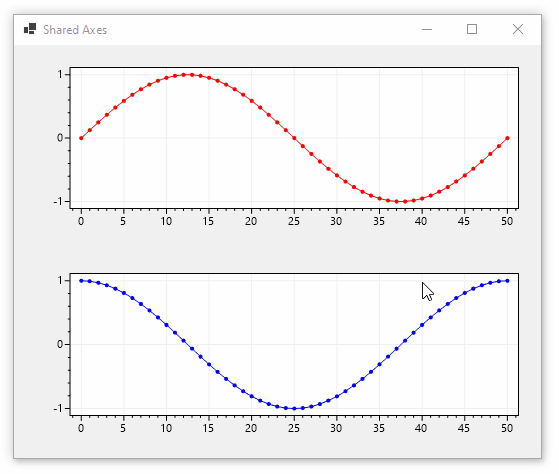
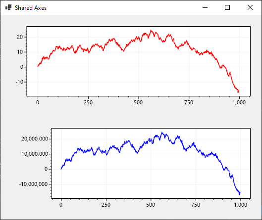
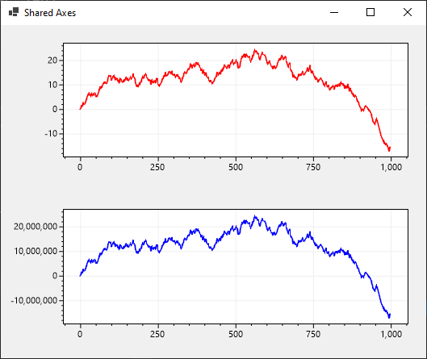

# User Controls with Shared Axes

**This page describes how to have two user controls with shared axes so that when one pans, the other pans automatically.** This example will showcase Windows Forms, but the technique is the same for all ScottPlot controls.

<div class="text-center">



</div>

## Windows Forms
[**Download this example from GitHub**](https://github.com/ScottPlot/Website/tree/main/src/faq/shared-axes/src/)

* Store your plots in an array at the class level
* Add your custom function to the `AxesChanged` event handler
* When an event is triggered, update axis limits for all the plots and request a render
* Temporarily disable axis changed events while changing the axes of the other plots to avoid an infinite loop

```cs
readonly FormsPlot[] FormsPlots;

public LinkedPlots()
{
    InitializeComponent();

    // plot sample data
    formsPlot1.Plot.AddSignal(DataGen.Sin(51));
    formsPlot2.Plot.AddSignal(DataGen.Cos(51));

    // populate array of plots for easy iteration later
    FormsPlots = new FormsPlot[] { formsPlot1, formsPlot2 };
    foreach (var fp in FormsPlots)
        fp.AxesChanged += OnAxesChanged;
}
```

```cs
private void OnAxesChanged(object sender, EventArgs e)
{
    FormsPlot changedPlot = (FormsPlot)sender;
    var newAxisLimits = changedPlot.Plot.GetAxisLimits();

    foreach (var fp in FormsPlots)
    {
        if (fp == changedPlot)
            continue;

        // disable events briefly to avoid an infinite loop
        fp.Configuration.AxesChangedEventEnabled = false;
        fp.Plot.SetAxisLimits(newAxisLimits);
        fp.Render();
        fp.Configuration.AxesChangedEventEnabled = true;
    }
}
```

## Matching Layouts

**Axes automatically determine their optimal size based on their font size and tick label content, but users who wish to make the layouts line-up across multiple controls will want to define axis size manually.** By setting the min and max size to the same number, you force that axis to be a fixed size.

Automatic Axis Sizes | Fixed Axis Sizes
---|---
|

[**Download this example from GitHub**](https://github.com/ScottPlot/Website/tree/main/src/faq/shared-axes/src/)

```cs
// plot sample data with greatly different Y scales
Random rand = new Random(0);
double[] ysSmall = DataGen.RandomWalk(1000, 1);
double[] ysBig = DataGen.RandomWalk(1000, 1e6);

formsPlot1.Plot.AddSignal(ysSmall, color: Color.Red);
formsPlot2.Plot.AddSignal(ysBig, color: Color.Blue);

// configure the left axis to always be 70 pixels wide
formsPlot1.Plot.YAxis.SetSizeLimit(min: 70, max: 70);
formsPlot2.Plot.YAxis.SetSizeLimit(min: 70, max: 70);
```