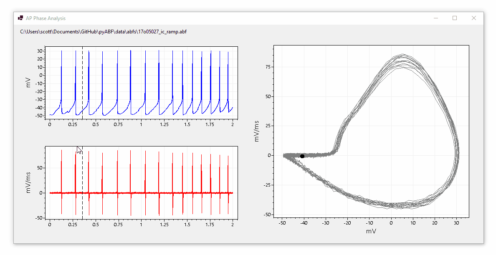

# User Controls with Shared Axes

This page describes how to have two user controls with shared axes so that when one pans, the other pans automatically. This example will showcase Windows Forms, but the technique is the same for all ScottPlot controls.

<div class="text-center">



</div>

## Windows Forms

* Store your plots in an array at the class level
* Add your custom function to the `AxesChanged` event handler
* When an event is triggered, update axis limits for all the plots and request a render
* Temporarily disable axis changed events while changing the axes of the other plots to avoid an infinite loop

```cs
readonly FormsPlot[] FormsPlots;

public LinkedPlots()
{
    InitializeComponent();

    // plot sample data
    formsPlot1.Plot.AddSignal(DataGen.Sin(51));
    formsPlot2.Plot.AddSignal(DataGen.Cos(51));

    // populate array of plots for easy iteration later
    FormsPlots = new FormsPlot[] { formsPlot1, formsPlot2 };
    foreach (var fp in FormsPlots)
        fp.AxesChanged += OnAxesChanged;
}
```

```cs
private void OnAxesChanged(object sender, EventArgs e)
{
    FormsPlot changedPlot = (FormsPlot)sender;
    var newAxisLimits = changedPlot.Plot.GetAxisLimits();

    foreach (var fp in FormsPlots)
    {
        if (fp == changedPlot)
            continue;

        // disable events briefly to avoid an infinite loop
        fp.Configuration.AxesChangedEventEnabled = false;
        fp.Plot.SetAxisLimits(newAxisLimits);
        fp.Render();
        fp.Configuration.AxesChangedEventEnabled = true;
    }
}
```