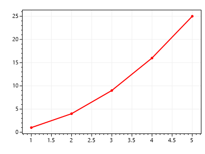
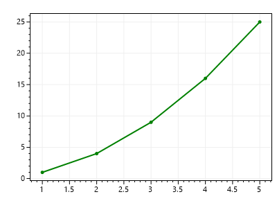

# ScottPlot Overview

This page summarizes the main concepts behind ScottPlot and is intended to help familiarize new users to its API.

**Table of Contents:**


## Plottable Objects

* A **Plottable** is anything you can display on a plot. 

* The **scatter plot** is the most commonly used plottable, and many plottables can be added to a plot. Other plottables like the **signal plot** offer superior performance for large datasets, so all plottable types should be considered.

* **You must call a control's `Render()` method** after modifying a plot's data or styling to request a redraw on the screen.

### Create Plottables with Helper Methods
The simplest way to plot data is to use helper methods. Helper methods create a plottable, customize it with optional methods, and add it to the plot.

```cs
double[] xs = { 1, 2, 3, 4, 5 };
double[] ys = { 1, 4, 9, 16, 25 };

var plt = new ScottPlot.Plot(400, 300);
plt.PlotScatter(xs, ys, color: Color.Red, lineWidth: 2);
plt.SaveFig("example.png");
```



### Plottables can be Modified After Creation

Helper methods return the plottable they create, allowing further customization using public fields and methods. 

In GUI environments, this is how plottable style and data can be modified after it has already been added to the plot.

```cs
var plt = new ScottPlot.Plot(400, 300);
var scatter = plt.PlotScatter(xs, ys);
scatter.color = Color.Blue;
scatter.lineWidth = 2;
plt.SaveFig("example.png");
```


### Create Plottables Manually

Creating a plottable manually gives the user maximum ability to customize it. It also allows users to create their own plot types and add them to the plot.

```cs
var plt = new ScottPlot.Plot(400, 300);
var scatter = new ScottPlot.Plottable.ScatterPlot(xs, ys);
scatter.color = Color.Green;
scatter.lineWidth = 2;
plt.SaveFig("example.png");
```



## Favor Signal Plot over Scatter Plot

* **Scatter plots have paired X/Y data points.** Scatter plots are designed to display ***hundreds*** of points, but performance rapidly drops as the number of points increases, so scatter plots are not appropriate for large datasets.

* **Signal plots have Y data and a sample rate.** Signal plots are optimized for performance and can render datasets with ***millions*** of points at a high framerate.

* **SignalConst** plots uses an algorithm optimized for constant data values, allowing interactive rendering of ***hundreds of millions*** of data points at a high framerate.

## Update Data in Existing Plottables

If you create a plottable by passing-in a data array, you can modify values in that data array later and those changes will automatically appear on the plot when it is rendered.

```cs
double[] xs = { 1, 2, 3, 4, 5 };
double[] ys = { 1, 4, 9, 16, 25 };

var plt = new ScottPlot.Plot(400, 300);
var scatter = plt.PlotScatter(xs, ys);
plt.SaveFig("example.png");
```


```cs
ys[2] = 23; // modify values inside an array
plt.SaveFig("example2.png"); // request a new render
```


* In this example the array is not changed (just the values inside the array). Different plot types have different fields and methods to facilitate updating data.

* To adjust axis limits to fit the new data call `plt.AxisAuto()`

* In GUI environments, call the control's `Render()` method to request a redraw on the screen after updating data

* In multi-threaded environments, use `Plot.RenderLock()` to ensure plottables are not modified in one thread while simultaneously rendering in another thread

## Axes and Axis Limits

* An **axis** displays information on one edge of a plot
  * The **axis label** is the title displayed on an axis
  * **Tick marks** are small lines drawn on the figure outside the data area
  * **Tick labels** can be displayed for each tick mark
  * **Grid lines** are lines at each tick mark drawn on the data area
  * **Axis lines** are single lines drawn on the edge of the axis. Axis lines of the four primary axes form a rectangle that outlines the data area.
  * Axes have **major ticks** and **minor ticks**. The default behavior is that both display axis lines and tick marks, but only major ticks display tick labels and grid lines.
* Plots have 4 axes by default
  * **Primary axes** on the bottom (`Plot.XAxis`) and left (`Plot.YAxis`) are fully visible by default
  * **Secondary axes** on the top (`Plot.XAxis2`) and right (`Plot.YAxis2`) only display axis lines by default
  * The **Title** of a plot is just the axis label of the top axis (`Plot.XAxis2`)
  * **Additional axes** can be added with `Plot.AddAxis()`
* Axis Limits
  * **SetAxisLimits()** manually defines limits for the primary axes
  * **AxisAuto()** automatically adjusts primary axis limits to fit visible data
  * **GetAxisLimits()** returns current limits for the primary axes
  * **SetAxisBoundaries()** can be used to ensure axis limits stay within a defined boundary

## Plot Using Multiple Axes
* Every axis has an **axis index**:
  * **Primary axes** (bottom and left) have index **`0`**
  * **Secondary axes** (top and right) are index **`1`**
  * **Additional axes** typically use index **`2`** and greater
* Every plottable has two **axis indexes**:
  * **`xAxisIndex`** defines the index of the horizontal axis to use
  * **`yAxisIndex`** defines the index of the vertical axis to use

## Layout
* The **figure area** is the full size of the plot, including axis labels, tick marks, and tick labels.
* The **data area** is the inner rectangle inside which data is displayed.
* The data area is **padded** by the total size of each axis.
* The **layout** is determined by the size of each rendered axis.
* The layout is **automatically calculated before every render**
* **Custom padding** of the data area can be achieved by defining minimum sizes for each axis. Increasing the minimum size increases padding.
* **A frameless layout** is one where where the data area occupies the full size of the figure area. A frameless effect can be achieved by setting the maximum size of every axis to zero.

## Live Display of Changing Data

There are 3 main ways to displaying changing data in a GUI

* **Change values in fixed-length arrays:** Plot fixed-length arrays once, then modify the values in those arrays at any time. Call the control's `Render()` to request a redraw of the plot containing the latest data.

* **Use a ScatterList plot type:** Unlike regular scatter plots which use fixed-length arrays, the ScatterList plot type is designed to have points added and removed.

* **Replace fixed-length arrays with new ones:** This method is not recommended for frequent updates because it is not performant. Scatter plots have a `ReplaceData()` method to facilitate this, and others use public fields to store data. Use the `RenderLock()` if calling this in a thread outside the GUI thread.

* **Clear and re-plot:** This method is not recommended for frequent updates because it is not performant. Every time the data changes `plt.Clear()` all the old plottables and add new ones to the plot. Use the `RenderLock()` if calling this in a thread outside the GUI thread.