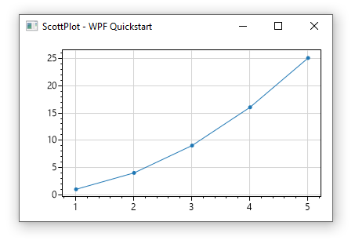
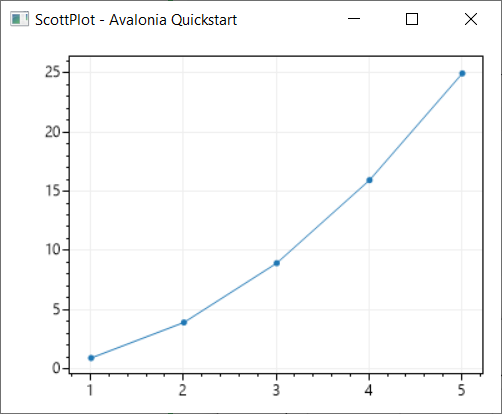

# ScottPlot Quickstart

* These examples demonstrate how to plot simple data with ScottPlot
* The **[ScottPlot Cookbook](http://swharden.com/scottplot/cookbook)** has many more advanced examples

<div class="alert alert-warning" role="alert">
  <h4 class="alert-heading">⚠️ Pre-Release Documentation</h4>
  This documentation is specific to <strong>ScottPlot 4.1</strong> which is currently available as a pre-release package on NuGet
</div>

**Table of Contents:**


## Console Quickstart

**Step 1:** Install the [`ScottPlot`](https://www.nuget.org/packages/ScottPlot) NuGet package

**Step 2:** Add the following to your start-up sequence:

```cs
double[] dataX = new double[] { 1, 2, 3, 4, 5 };
double[] dataY = new double[] { 1, 4, 9, 16, 25 };
var plt = new ScottPlot.Plot(400, 300);
plt.AddScatter(dataX, dataY);
plt.SaveFig("quickstart.png");
```


_Source code for this application is [available on GitHub](https://github.com/ScottPlot/Website/tree/main/src/quickstart/src/quickstart-console)_

## Windows Forms Quickstart

**Step 1:** Install the [`ScottPlot.WinForms`](https://www.nuget.org/packages/ScottPlot.WinForms) NuGet package

**Step 2:** Drag a `FormsPlot` from the Toolbox onto your Form

**Step 3:** Plot some data in your start-up sequence

```cs
double[] dataX = new double[] {1, 2, 3, 4, 5};
double[] dataY = new double[] {1, 4, 9, 16, 25};
formsPlot1.Plot.AddScatter(dataX, dataY);
```


_Source code for this application is [available on GitHub](https://github.com/ScottPlot/Website/tree/main/src/quickstart/src/quickstart-winforms)_

## WPF Quickstart

**Step 1:** Install the [`ScottPlot.WPF`](https://www.nuget.org/packages/ScottPlot.WPF) NuGet package

**Step 2:** Add a `WpfPlot` to your layout and give it a unique name
```xml
<WpfPlot Name="WpfPlot1" />
```

**Step 3:** Plot some data in your start-up sequence

```cs
double[] dataX = new double[] { 1, 2, 3, 4, 5 };
double[] dataY = new double[] { 1, 4, 9, 16, 25 };
WpfPlot1.Plot.AddScatter(dataX, dataY);
```



_Source code for this application is [available on GitHub](https://github.com/ScottPlot/Website/tree/main/src/quickstart/src/quickstart-wpf)_

## Avalonia Quickstart

**Step 1:** Install the [`ScottPlot.Avalonia`](https://www.nuget.org/packages/ScottPlot.Avalonia) NuGet package

**Step 2:** Import the `ScottPlot.Avalonia` namespace by adding this to your `Window` element:
```xml
xmlns:ScottPlot="clr-namespace:ScottPlot.Avalonia;assembly=ScottPlot.Avalonia"
```

Your `Window` element should look something like this:

```xml
<Window xmlns="https://github.com/avaloniaui"
        <!-- More attributes -->
        x:Class="ScottPlot.Demo.Avalonia.MainWindow"
        xmlns:ScottPlot="clr-namespace:ScottPlot.Avalonia;assembly=ScottPlot.Avalonia"
        Title="Avalonia Quickstart" Width="500" Height="350">
```


**Step 3:** Add an AvaPlot to your layout and give it a unique name
```xml
<ScottPlot:AvaPlot Name="AvaPlot1"/>
```

**Step 4:** Plot some data in your start-up sequence

```cs
AvaPlot avaPlot1 = this.Find<AvaPlot>("AvaPlot1");

double[] dataX = new double[] { 1, 2, 3, 4, 5 };
double[] dataY = new double[] { 1, 4, 9, 16, 25 };
avaPlot1.Plot.AddScatter(dataX, dataY);
```



_Source code for this application is [available on GitHub](https://github.com/ScottPlot/Website/tree/main/src/quickstart/src/quickstart-avalonia)_
